# LIO-SAM Inspired Graph-SLAM on KITTI Benchmark


Graph-SLAM on KITTI odometry benchmark, implemented in two milestones:

- **Milestone 1:** LiDAR-only pipeline — KISS-ICP front-end, Scan Context loop closure detection with ICP verification, GTSAM ISAM2 pose graph optimization.
- **Milestone 2:** LIO-SAM inspired loosely-coupled LiDAR-IMU fusion — IMU gyroscope rotation as additional graph constraints, with Huber robust noise model.

---

## Milestone 1 — LiDAR-only Graph-SLAM

### Architecture

```
LiDAR scan
    │
    ▼
KISS-ICP  ──────────────────────────► Odometry factor
    │                                        │
    ▼                                        ▼
Scan Context                          GTSAM ISAM2
 + KD-tree                           pose graph
    │                                        │
    ▼                                        ▼
ICP verification  ──────────────► Loop closure factor
```

**Front-end:** KISS-ICP registers consecutive scans using point-to-point ICP with a constant velocity motion model for initial pose prediction.

**Loop closure:** Each scan is encoded as a Scan Context descriptor — a polar 2D matrix of max point heights per (ring, sector) bin. Ring keys (per-ring mean vectors) are stored in a KD-tree for fast candidate retrieval. Candidates are verified with Open3D ICP using the Scan Context yaw estimate as the initial guess.

**Back-end:** GTSAM ISAM2 incrementally optimizes the pose graph as new odometry and loop closure factors arrive.

### Results

#### Sequence 07 — short urban loop (0.7 km)

Seq 07 has a single loop closure between its start and end. KISS-ICP performs well on this short sequence (APE ~0.8 m), so loop closure has marginal numerical impact — but the system correctly detects the loop and the optimization is consistent.

| Method | APE rmse | APE mean | APE max |
|--------|----------|----------|---------|
| KISS-ICP | 0.799 m | 0.695 m | 1.430 m |
| ISAM2 + loops | 0.846 m | 0.733 m | 1.558 m |

RPE trans rmse: 0.025 m &nbsp;|&nbsp; RPE rot rmse: 0.079°

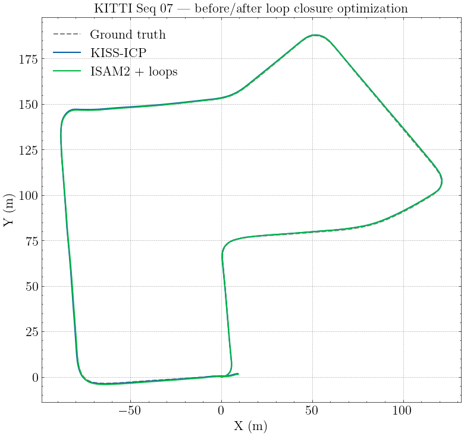
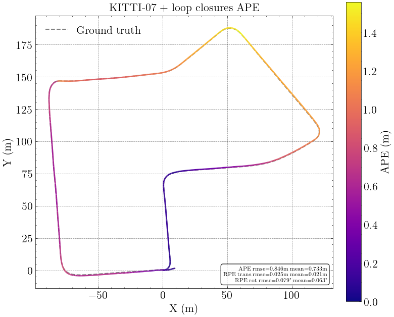
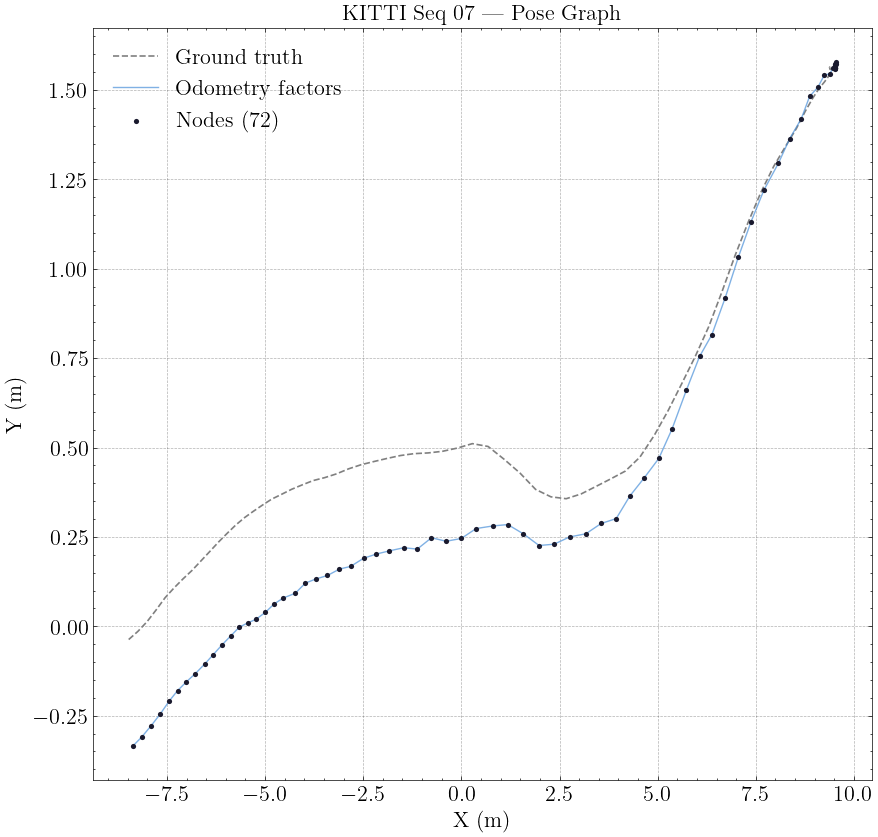

<details>
<summary>Zoom views</summary>

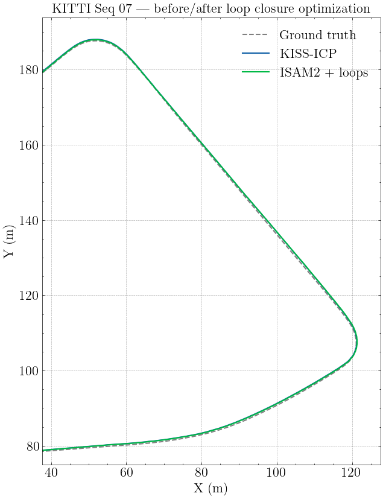
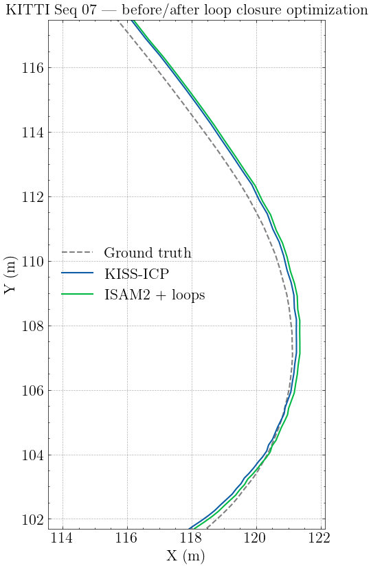
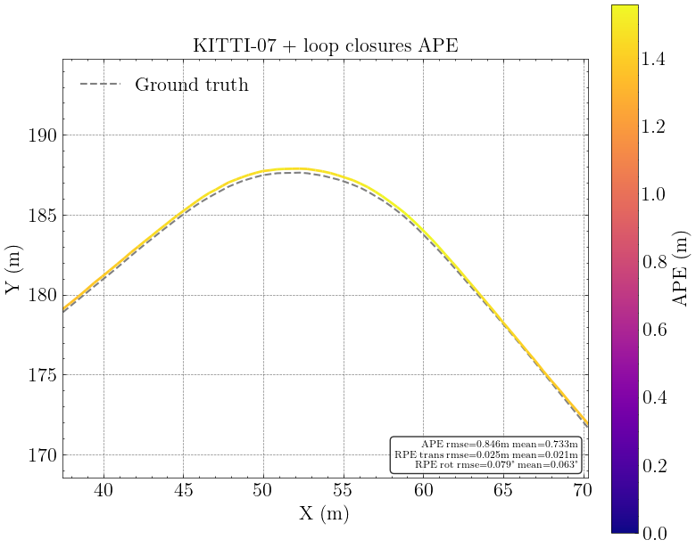

</details>

---

#### Sequence 06 — urban loop (1.2 km)

Loop closure reduces APE rmse from 2.79 m to 2.71 m (−3%). The improvement is visible in the trajectory: the optimized path closes tighter than raw odometry.

| Method | APE rmse | APE mean | APE max |
|--------|----------|----------|---------|
| KISS-ICP | 2.793 m | 2.247 m | 6.280 m |
| ISAM2 + loops | 2.708 m | 2.033 m | 5.718 m |

RPE trans rmse: 0.027 m &nbsp;|&nbsp; RPE rot rmse: 0.044°

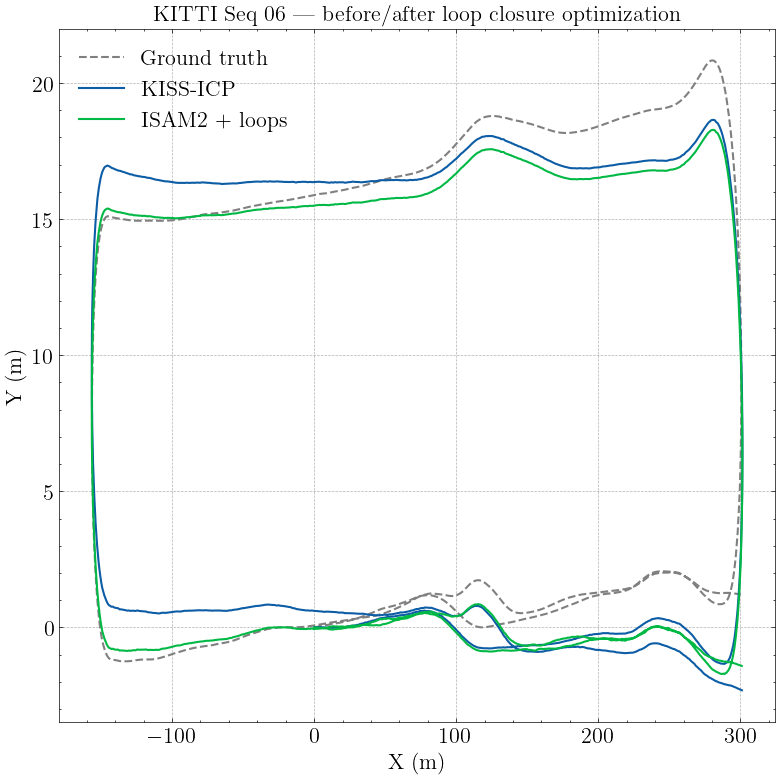


<details>
<summary>Zoom views</summary>

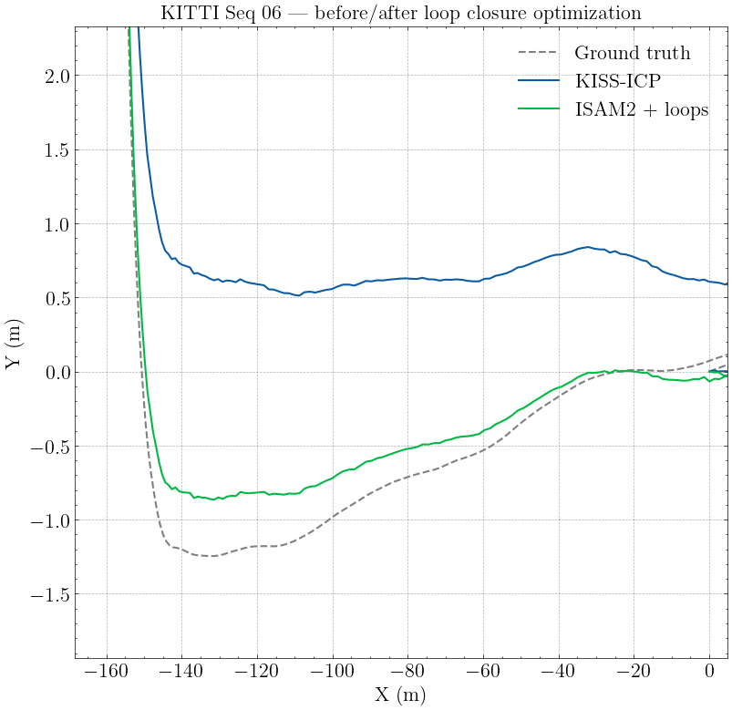
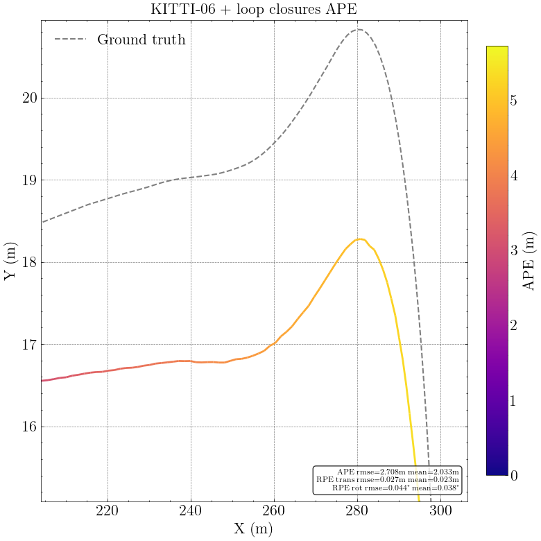

</details>

---

#### Sequence 00 — long urban sequence with multiple loops (3.7 km)

The largest sequence tested. Multiple loop closures are detected across the trajectory. APE rmse improves from 12.53 m to 10.91 m (−13%). The effect is clearly visible — the graph pulls sub-trajectories into alignment at each detected loop.

| Method | APE rmse | APE mean | APE max |
|--------|----------|----------|---------|
| KISS-ICP | 12.531 m | 11.177 m | 27.136 m |
| ISAM2 + loops | 10.910 m | 9.235 m | 25.765 m |

RPE trans rmse: 0.037 m &nbsp;|&nbsp; RPE rot rmse: 0.152°

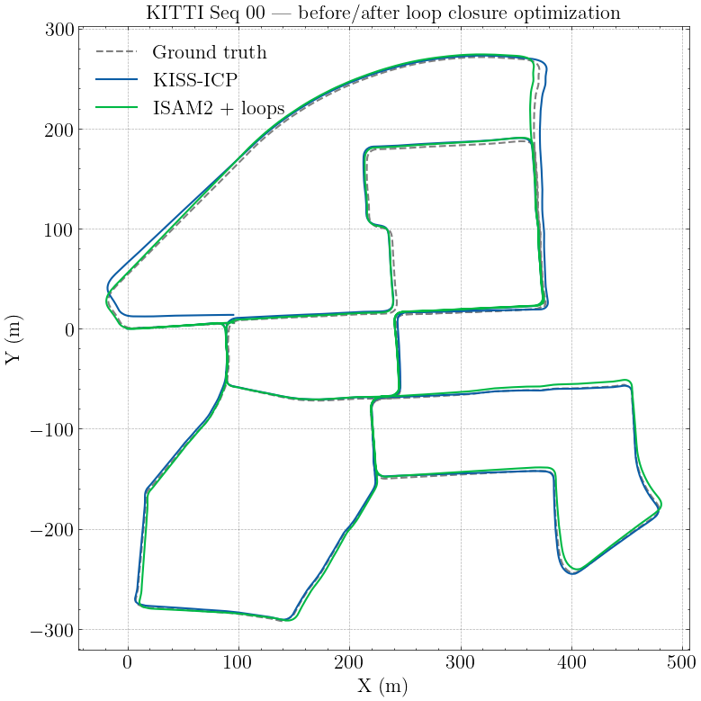
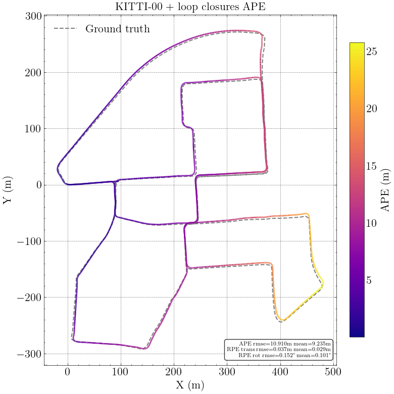

<details>
<summary>Zoom views</summary>

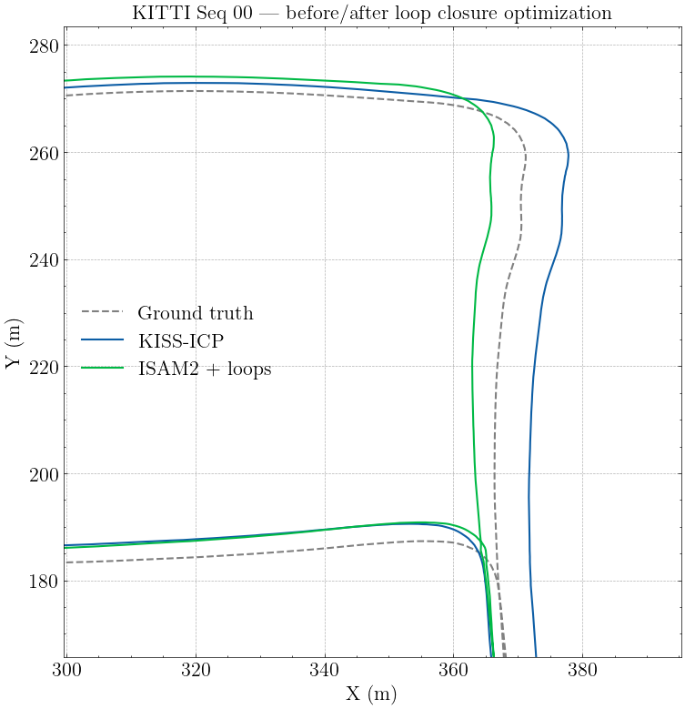
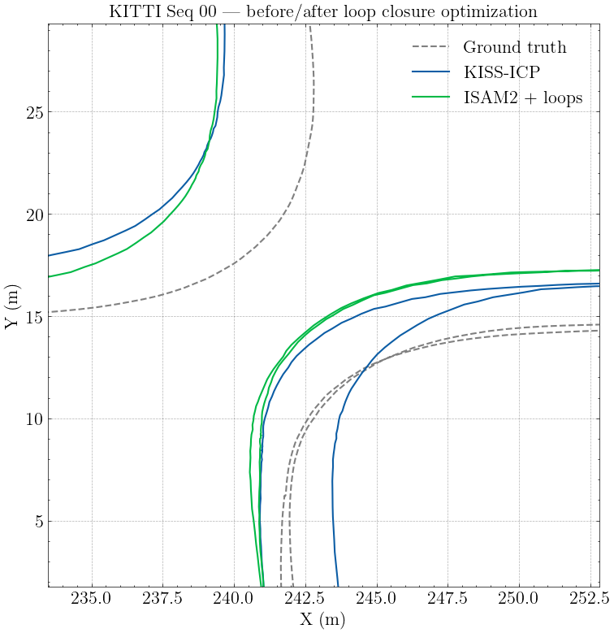
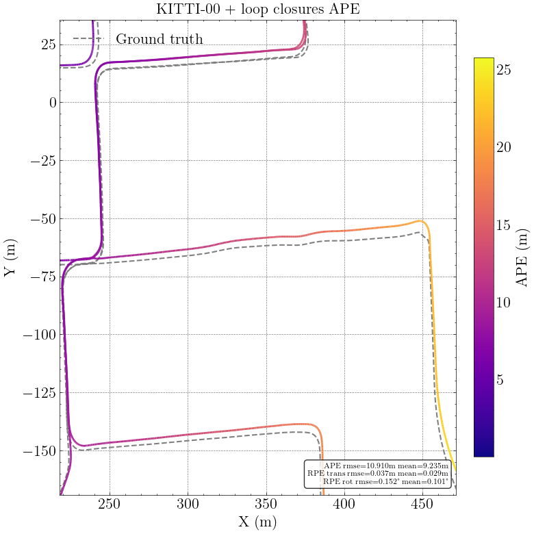

</details>

---

### Discussion

Loop closure benefit scales with sequence length and accumulated drift. On seq 07 (0.7 km, low drift), the single detected loop barely moves the numbers. On seq 00 (3.7 km, multiple loops), the improvement is clearly measurable. This is expected: graph optimization can only redistribute existing drift — the more drift there is to correct, the more visible the gain.

RPE is identical before/after optimization across all sequences. This confirms that loop closures affect global consistency (APE) but not local odometry accuracy (RPE), which is determined entirely by KISS-ICP.

The primary limitation at this stage is LiDAR-only operation — addressed in Milestone 2.

---

## Milestone 2 — LiDAR-IMU Graph-SLAM

### Architecture

```
LiDAR scan
    │
    ▼
KISS-ICP  ──────────────────────────► Odometry factor (BetweenFactorPose3)
    │                                        │
    ├──► Scan Context + ICP  ──────► Loop closure factor
    │                                        │
    │                                        ▼
    │                                 GTSAM ISAM2
    │                                 pose graph
    │                                        ▲
IMU (OXTS)                                   │
    │                                        │
    ▼                                        │
Gyro integration  ─────────────────► IMU factor (BetweenFactorPose3, Huber)
(Rodrigues formula)                  [rotation: IMU gyro, translation: KISS-ICP]
```

**IMU integration:** Between each pair of consecutive LiDAR frames, raw gyroscope measurements (~10 samples at 100 Hz over 0.1 s) are integrated using the Rodrigues rotation formula in the velodyne body frame. The resulting rotation is combined with the KISS-ICP translation estimate to form a hybrid relative pose constraint.

**Noise model:** The IMU factor uses a Huber robust noise model (k=1.345) with loose sigmas `[1.0, 1.0, 1.0, 5.0, 5.0, 5.0]` (rad, rad, rad, m, m, m). This ensures the IMU acts as a gentle regularizer — it can nudge the solution when LiDAR is uncertain, but never overrides the tighter odometry factor (`[0.1, 0.1, 0.1, 0.5, 0.5, 0.5]`).

**Graph structure:** Each edge between consecutive nodes carries two `BetweenFactorPose3` constraints: one tight (KISS-ICP odometry) and one loose with Huber (IMU gyro). Loop closure factors are identical to Milestone 1.

### Results

#### Sequence 07 — short urban loop (0.7 km)

| Method | APE rmse | APE mean | APE max |
|--------|----------|----------|---------|
| KISS-ICP | 0.799 m | 0.695 m | 1.430 m |
| M1: ISAM2 + loops | 0.846 m | 0.733 m | 1.558 m |
| M2: ISAM2 + IMU + loops | 0.843 m | 0.729 m | 1.549 m |

On this short, low-drift sequence the IMU contribution is negligible — KISS-ICP's 0.08° RPE rotation already exceeds what the gyroscope can offer.

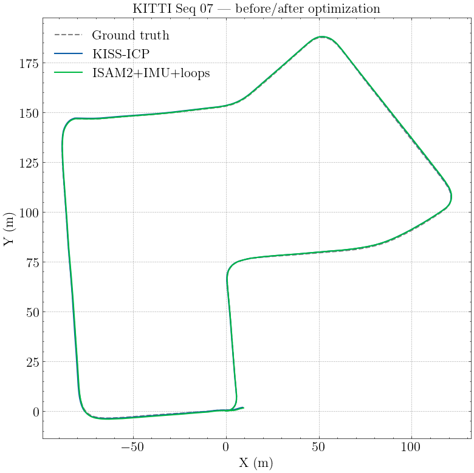
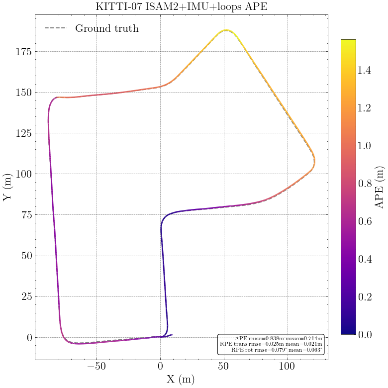
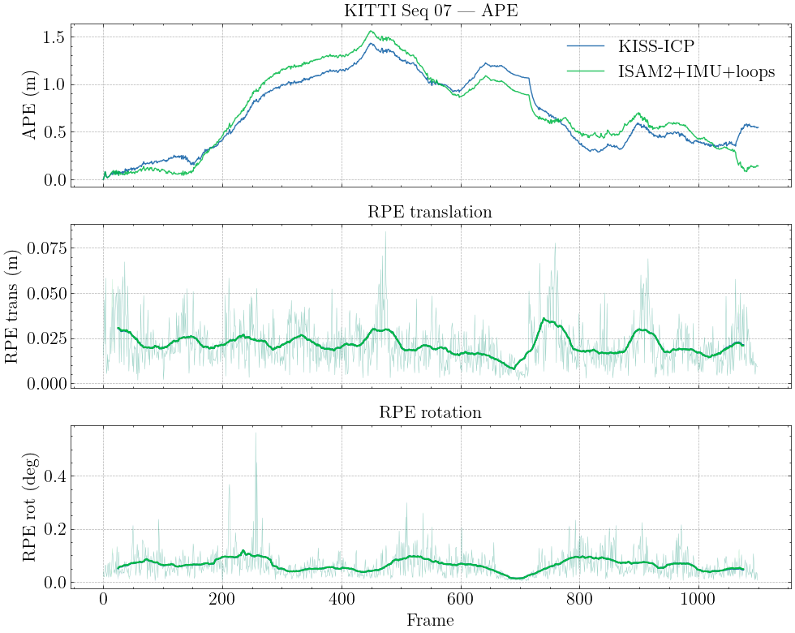
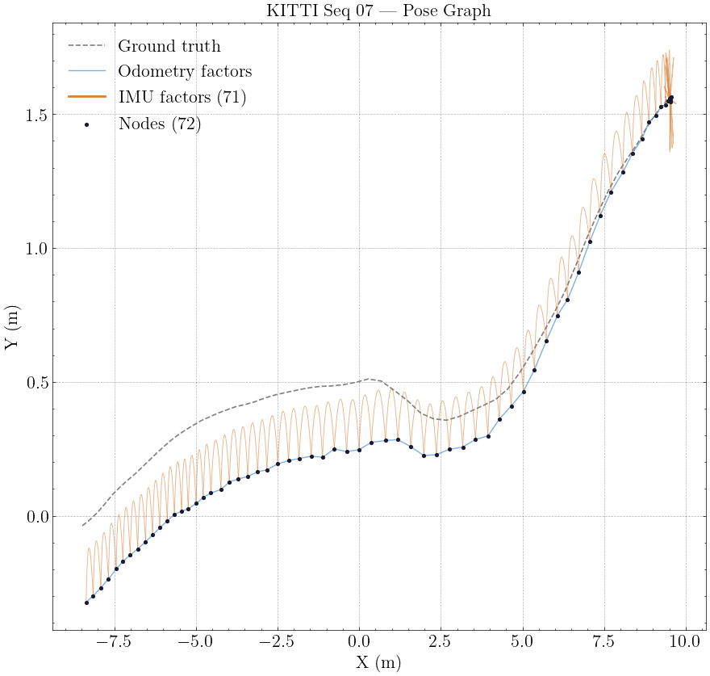

<details>
<summary>Zoom views</summary>

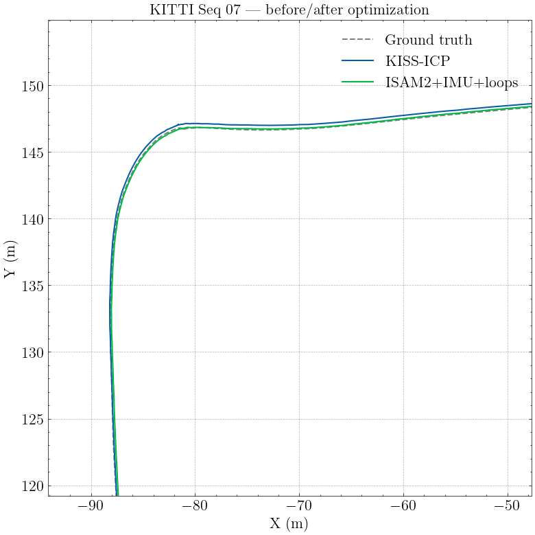
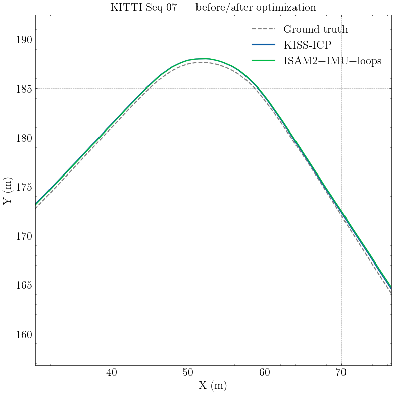

</details>

---

#### Sequence 06 — urban loop (1.2 km)

| Method | APE rmse | APE mean | APE max |
|--------|----------|----------|---------|
| KISS-ICP | 2.793 m | 2.247 m | 6.280 m |
| M1: ISAM2 + loops | 2.708 m | 2.033 m | 5.718 m |
| M2: ISAM2 + IMU + loops | **2.637 m** | **1.990 m** | **5.603 m** |

Best IMU improvement: APE rmse drops from 2.71 m (M1) to 2.64 m (M2), a 2.6% reduction on top of loop closures. The gyroscope regularization helps most where KISS-ICP's rotational uncertainty is highest.

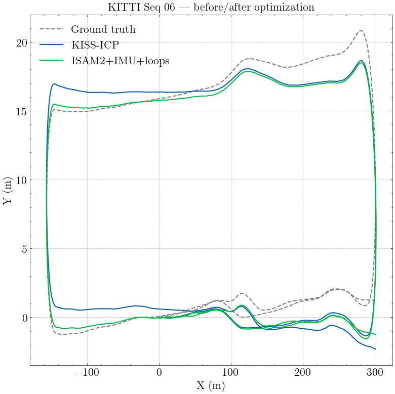
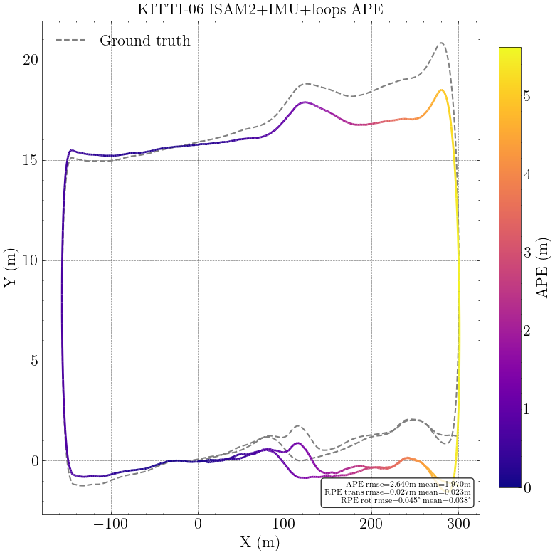
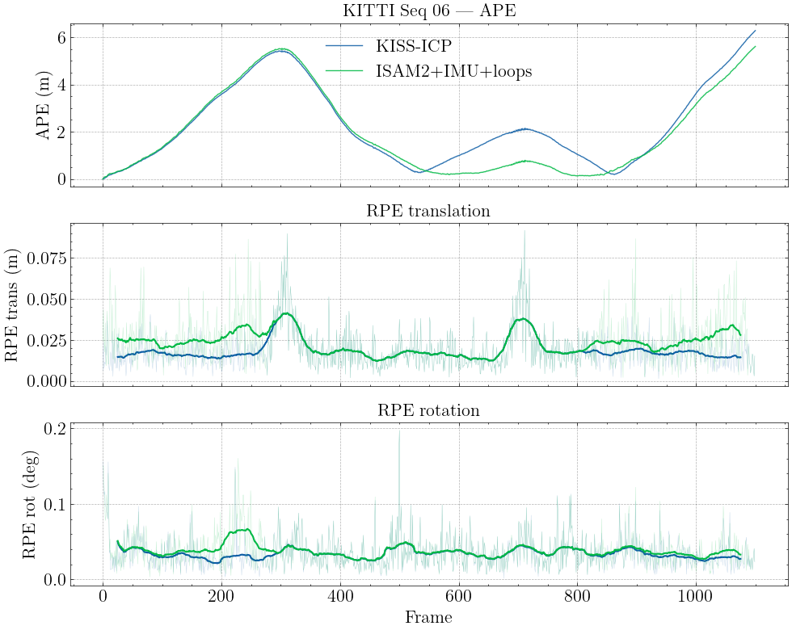

---

#### Sequence 00 — long urban sequence with multiple loops (3.7 km)

| Method | APE rmse | APE mean | APE max |
|--------|----------|----------|---------|
| KISS-ICP | 12.531 m | 11.177 m | 27.136 m |
| M1: ISAM2 + loops | **10.910 m** | **9.235 m** | **25.765 m** |
| M2: ISAM2 + IMU + loops | 11.009 m | 9.431 m | 25.589 m |

On this long sequence the IMU slightly hurts APE rmse compared to M1, but reduces APE max. The systematic gyroscope yaw scale error (~0.5° per frame) accumulates over 4500 frames, occasionally pulling the optimizer away from the LiDAR solution. The Huber robust model limits the damage, but cannot fully eliminate it.

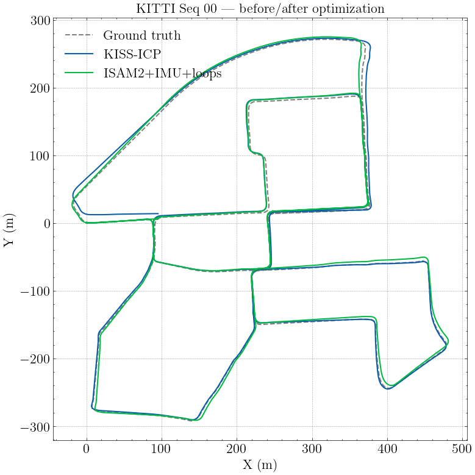
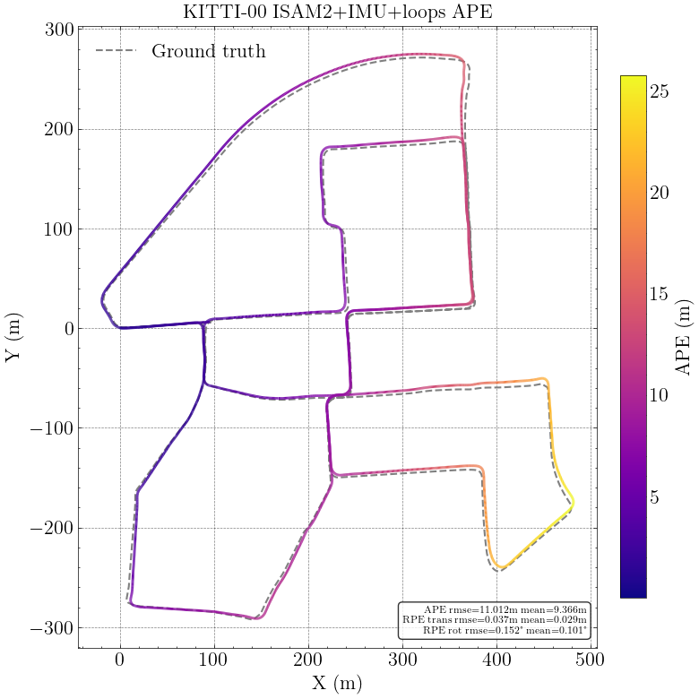
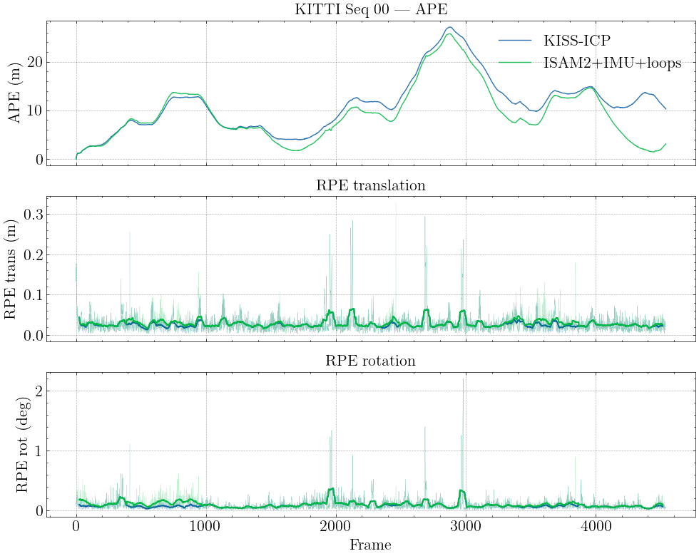

<details>
<summary>Zoom views</summary>

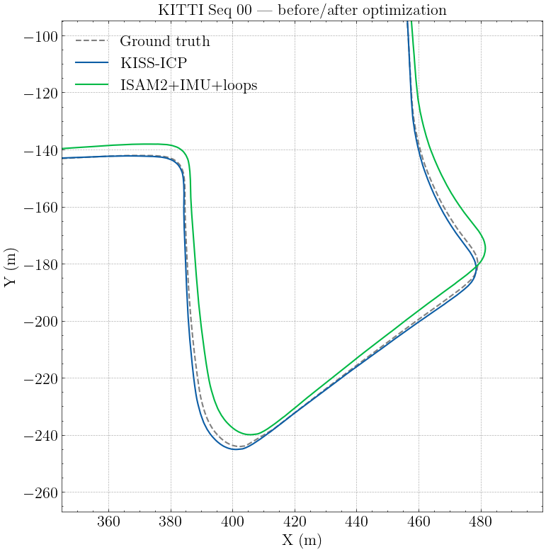
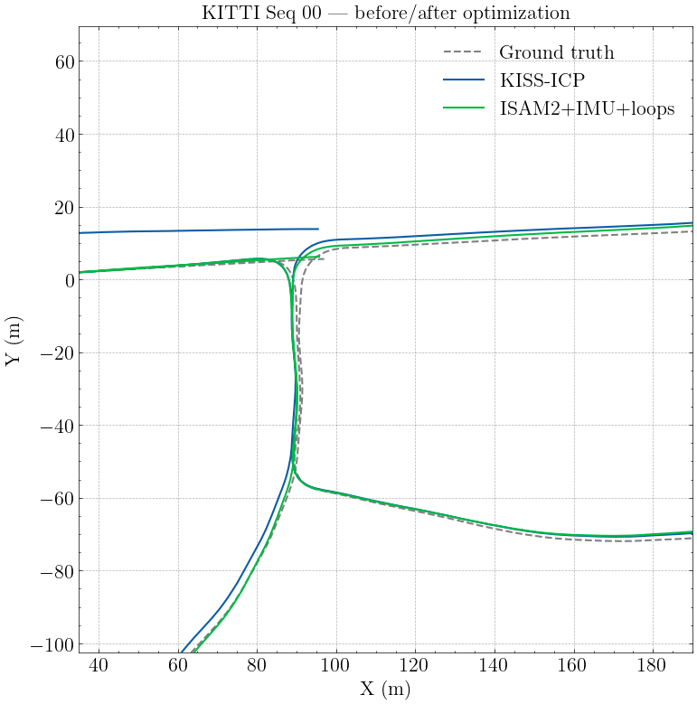

</details>

---

### What we tried (and why it didn't work)

Milestone 2 involved extensive experimentation with different IMU fusion strategies. The final gyro-only loosely-coupled approach emerged after systematic elimination of alternatives:

#### 1. Tightly-coupled IMU preintegration (CombinedImuFactor)

Following LIO-SAM, we implemented a full IMU pose graph with velocity and bias state variables at each node (`X(i)`, `V(i)`, `B(i)`) and `CombinedImuFactor` between consecutive states. This required `gtsam.PreintegratedCombinedMeasurements` with KITTI OXTS noise parameters.

**Result:** Bias estimator diverged, APE 14.4 m on seq 06 (vs 2.8 m baseline). The root cause is that KITTI lacks hardware-synchronized timestamps between the LiDAR and IMU — the ~1 ms timing offset between sensors gets absorbed by the bias estimator, causing it to compensate for a systematic error that isn't actually bias. LIO-SAM avoids this because it runs on hardware-synced platforms (e.g., Ouster LiDAR with built-in IMU).

#### 2. Full IMU preintegration as BetweenFactorPose3

Used GTSAM `PreintegratedCombinedMeasurements` to predict a full relative pose (rotation + translation), then injected it as a `BetweenFactorPose3`. This avoids velocity/bias states but uses the complete IMU prediction.

**Result:** APE 57 m on seq 00. The translation prediction requires double-integrating accelerometer readings, which needs accurate velocity estimates and gravity compensation. Without a proper velocity state in the graph, the integrated translation diverges within a few frames.

#### 3. IMU-based point cloud deskewing

Implemented rotation-only deskewing using gyroscope integration during each scan (~0.1 s). Per-point azimuth timestamps map each point to its capture time. Points are rotated from their capture-time body frame to the scan-end frame before KISS-ICP registration.

**Result:** KISS-ICP APE degraded from 0.80 m to 0.87 m on seq 07, and from 2.79 m to 5.65 m on seq 06. KISS-ICP's adaptive threshold and voxel map are tuned for the distorted point pattern — removing distortion changes the point distribution and degrades ICP matching. KISS-ICP was explicitly designed to handle scan distortion implicitly through its robust ICP, making external deskewing counterproductive. Their own KITTI odometry dataset passes empty timestamps (no deskew).

#### 4. KISS-ICP's built-in deskew with azimuth timestamps

Enabled `deskew=True` in KISS-ICP and passed azimuth-based per-point timestamps. Initially used the wrong azimuth convention (`atan2(y,x)` instead of `-atan2(y,x)`), then fixed it to match KISS-ICP's own KITTI raw dataset.

**Result:** Even with correct timestamps, APE degraded — same root cause as above. KISS-ICP's constant-velocity deskew model introduces more error than it removes on KITTI's relatively low-speed urban driving.

#### 5. Accelerometer translation in the hybrid delta

Combined IMU gyro rotation with IMU accelerometer-based translation prediction (instead of using KISS-ICP translation). Tested with full `PreintegratedCombinedMeasurements.predict()` to get both rotation and translation from IMU.

**Result:** APE 3.71 m on seq 06 (vs 2.64 m gyro-only). Accelerometer double-integration without velocity state feedback amplifies noise and timing errors. The translation component is strictly worse than KISS-ICP's direct ICP estimate.

#### 6. Gyro noise tuning and scale error diagnosis

Tested rotation noise sigmas from 0.05 rad (tight) to 1.0 rad (loose). Tight rotation noise (0.05 rad) caused catastrophic failure on seq 00 (APE 126 m) because it forced the optimizer to trust the IMU rotation over KISS-ICP.

**Diagnostic finding:** The IMU gyroscope has a systematic yaw scale error of ~0.5° per frame, purely around the Z-axis, that grows proportionally with rotation magnitude. This is a scale factor (not additive bias), so in-graph bias estimation cannot correct it. The error likely stems from approximate timestamp alignment between KITTI's OXTS and Velodyne sensors.

### Discussion

The core finding is that in KITTI's feature-rich urban environment, KISS-ICP achieves 0.08° RPE rotation — the IMU gyroscope at ~0.5° disagreement cannot improve on this. The IMU's value is limited to acting as a gentle regularizer through very loose noise sigmas and Huber robust downweighting.

This contrasts with LIO-SAM's design assumptions: LIO-SAM targets platforms with hardware-synchronized IMU (200+ Hz) and operates in feature-sparse environments where LiDAR odometry alone may fail. On KITTI, the LiDAR front-end is already strong enough that the IMU contribution is marginal at best.

The loosely-coupled approach (gyro rotation as `BetweenFactorPose3`) was chosen over tightly-coupled (`CombinedImuFactor` with velocity/bias states) because:
1. KITTI's lack of hardware-synchronized timestamps causes bias estimator divergence
2. The dominant gyroscope error is a scale factor, not an additive bias — bias estimation cannot correct it
3. The simpler graph structure (Pose3 nodes only) is more robust to IMU noise

## Setup

Tested on Linux x86_64:
- Ubuntu 24.04.4 LTS
- g++ 13.3.0
- Python 3.12
- System dependency: `libeigen3-dev`

```bash
sudo apt install libeigen3-dev
git submodule update --init
uv sync
scripts/build_scancontext.sh
uv run scripts/test_scancontext.py  # verify Scan Context works
```

## Usage

```bash
# Milestone 1: LiDAR-only
uv run main.py --milestone 1 --sequence 07

# Milestone 2: LiDAR-IMU
uv run main.py --milestone 2 --sequence 07
```

KITTI odometry data (sequences + calibration) should be placed under `data/`. Download the velodyne scans, ground truth poses, and calibration files from the [KITTI odometry benchmark](https://www.cvlibs.net/datasets/kitti/eval_odometry.php). The expected layout is:

```
data/
├── poses/
│   ├── 00.txt
│   ├── 01.txt
│   └── ...
└── sequences/
    ├── 00/
    │   ├── calib.txt
    │   ├── times.txt
    │   └── velodyne/
    │       ├── 000000.bin
    │       ├── 000001.bin
    │       └── ...
    ├── 01/
    └── ...
```

For Milestone 2, KITTI raw data (OXTS IMU + velodyne timestamps) is additionally required under `data/raw/`. Download the synced+rectified data and calibration from [KITTI raw](https://www.cvlibs.net/datasets/kitti/raw_data.php) for the corresponding drives:

```
data/raw/
├── 2011_09_30/
│   ├── calib_imu_to_velo.txt
│   ├── calib_velo_to_cam.txt
│   └── 2011_09_30_drive_0027_extract/
│       ├── oxts/
│       │   ├── data/
│       │   └── timestamps.txt
│       └── velodyne_points/
│           └── timestamps.txt
└── 2011_10_03/
    └── ...
```

Available odometry-to-raw mappings: seq 00 (drive 0027), seq 06 (drive 0020), seq 07 (drive 0027).

Note: KITTI distributes calibration files separately from the velodyne scans. Merge them into each sequence directory so that `calib.txt` sits alongside `velodyne/`.

## References

1. [KISS-ICP](https://www.ipb.uni-bonn.de/wp-content/papercite-data/pdf/vizzo2023ral.pdf) — Vizzo et al., RA-L 2023
2. [KITTI benchmark](https://www.cvlibs.net/publications/Geiger2013IJRR.pdf) — Geiger et al., IJRR 2013
3. [LIO-SAM](https://arxiv.org/pdf/2007.00258) — Shan et al., IROS 2020
4. [Scan Context](https://ieeexplore.ieee.org/document/8593953) — Kim & Kim, IROS 2018
